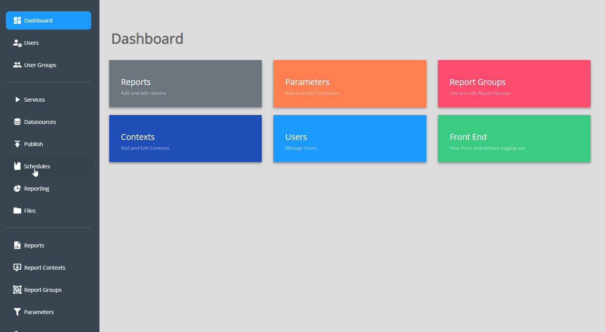
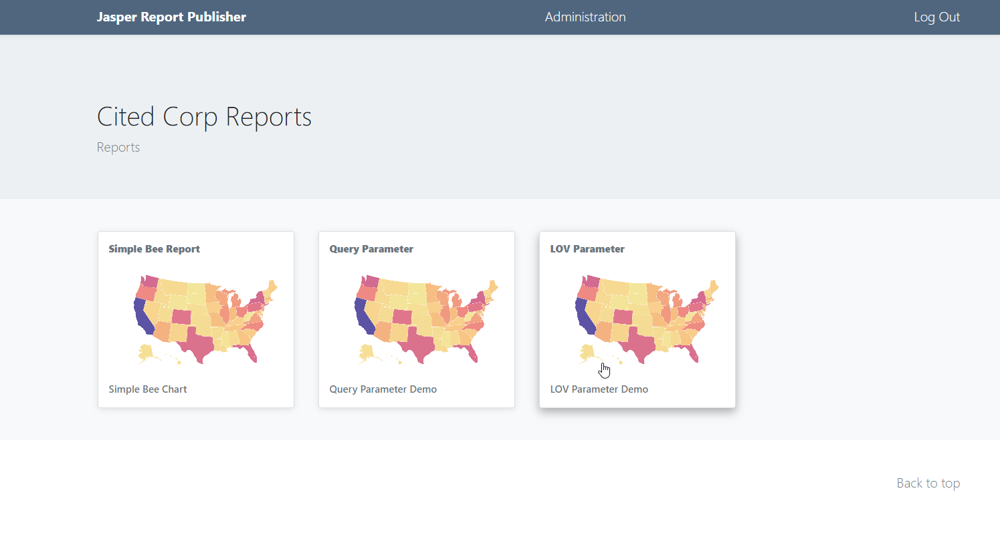
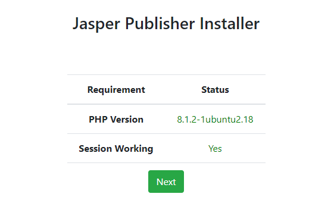
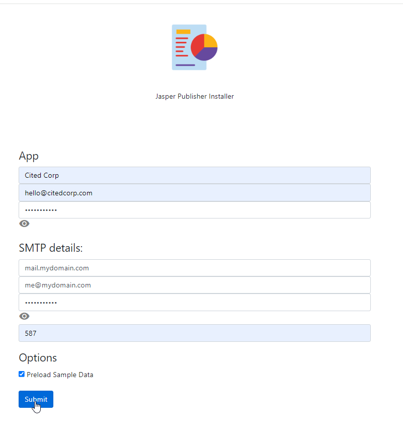
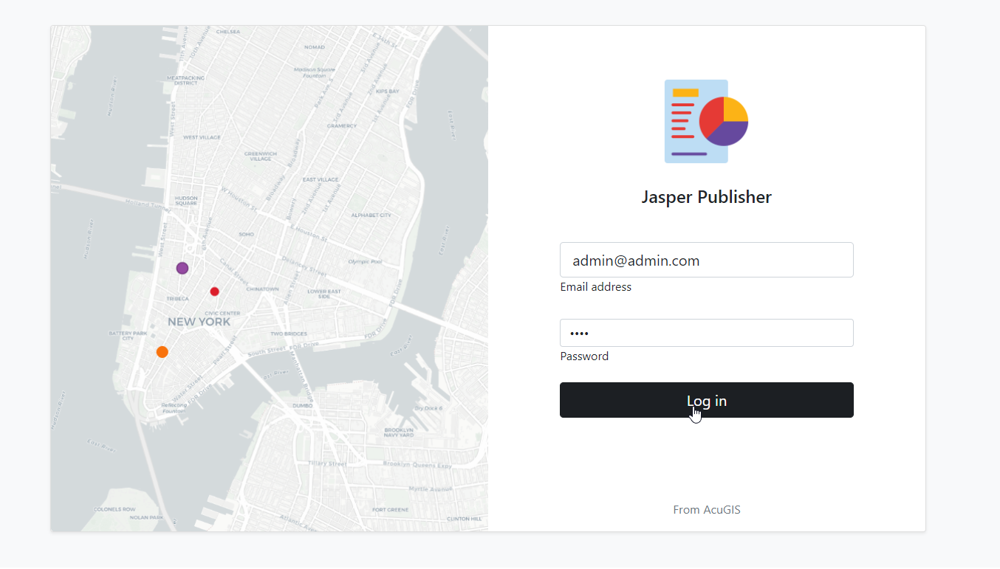

# Jasper Report Publisher

## Publish, schedule, email, and run reports on demand

## Overview

Jasper Publisher publishes, schedules, emails, and runs Jasper Reports on demand.

It supports PotgreSQL, Oracle, MySQL, and MSSQL and you can add additional data sources.

Jasper Report Publisher is free, Open Source software built around [JasperReportsIntegration](https://github.com/daust/JasperReportsIntegration)/). 

## Install
Install on Ubuntu 22

Installation is done via the install scripts located in the /installer directory.

System Requirements
=======================
* PostgreSQL 16
* PHP >= 8.1
* 2 GB RAM
* 5 GB Disk
* Tested on Ubuntu 22

Running the Installer
=======================

Clone or download the repoistory::

    git clone https://github.com/AcuGIS/Jasper-Publisher
    mv Jasper-Publisher-master Jasper-Publisher

Navigate to /JasperPublisher and run the installers::

     ./installer/postgres.sh
     ./installer/app-install.sh
     ./installer/jri-install.sh
     ./installer/jri-sample.sh

Optionally, run below to provision SSL using letsencrypt::

    apt-get -y install python3-certbot-apache
    certbot --apache --agree-tos --email hostmaster@yourdomain.com --no-eff-email -d yourdomain.com

Navigate to https://yourdomain.com/admin/setup.php:

Enter the information for the PostgreSQL database you created:

The installer will create the required objects in PostgreSQL

When the installer completes, you can log in using the email and password you selected above.

PhantomJS
===================

Printing of GroupedReports requires phantomjs to be installed on your server.

 
## Documentation

Jasper Report Publisher [Documentation](https://jasper-report-publisher.docs.acugis.com).

## License
Version: MPL 2.0

The contents of this file are subject to the Mozilla Public License Version 2.0 (the "License"); you may not use this file except in compliance with the License. 

You may obtain a copy of the License at http://www.mozilla.org/MPL/
