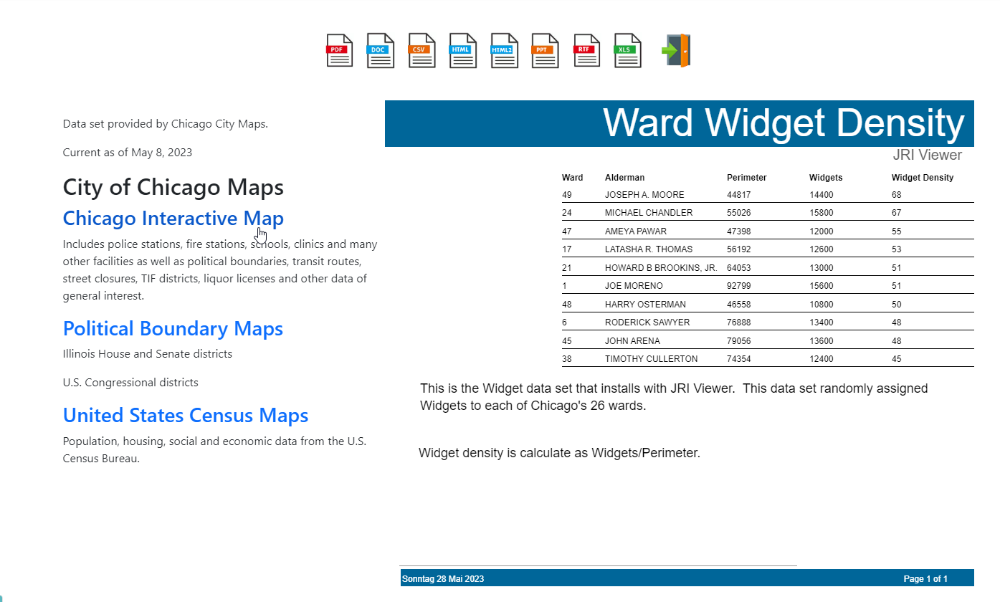
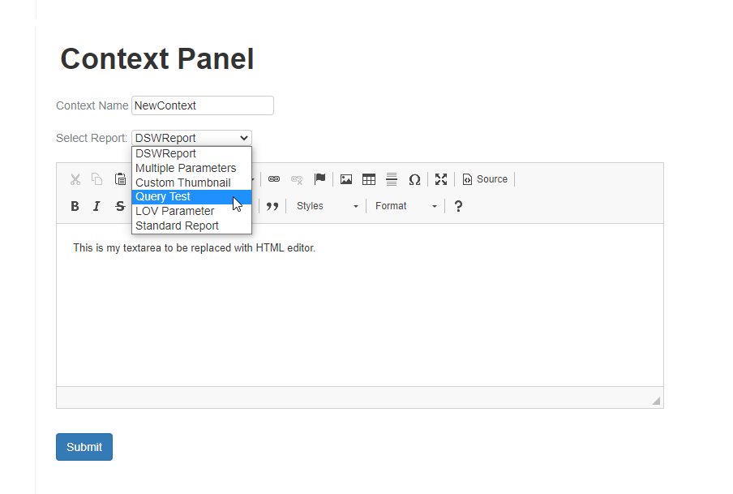

.. This is a comment. Note how any initial comments are moved by
   transforms to after the document title, subtitle, and docinfo.

.. demo.rst from: http://docutils.sourceforge.net/docs/user/rst/demo.txt

.. |EXAMPLE| image:: static/yi_jing_01_chien.jpg
   :width: 1em

**********************
Context
**********************

.. contents:: Table of Contents
Overview
==================

You can a Context ares to any report.

A Context area provides supporting information, links, and any other HTML content you wish to add.

Add Context
================

To add a new Context, click the "Add New" button at top.

Select the report from the drop down menu as show below:

Enter the Context to appear next to the generated report.  

Edit Context
======================
To edit a Context, click the edit link as shown below

.. image:: Set-Context.png

