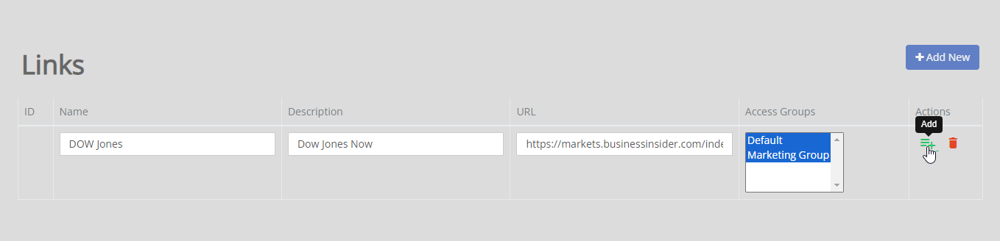
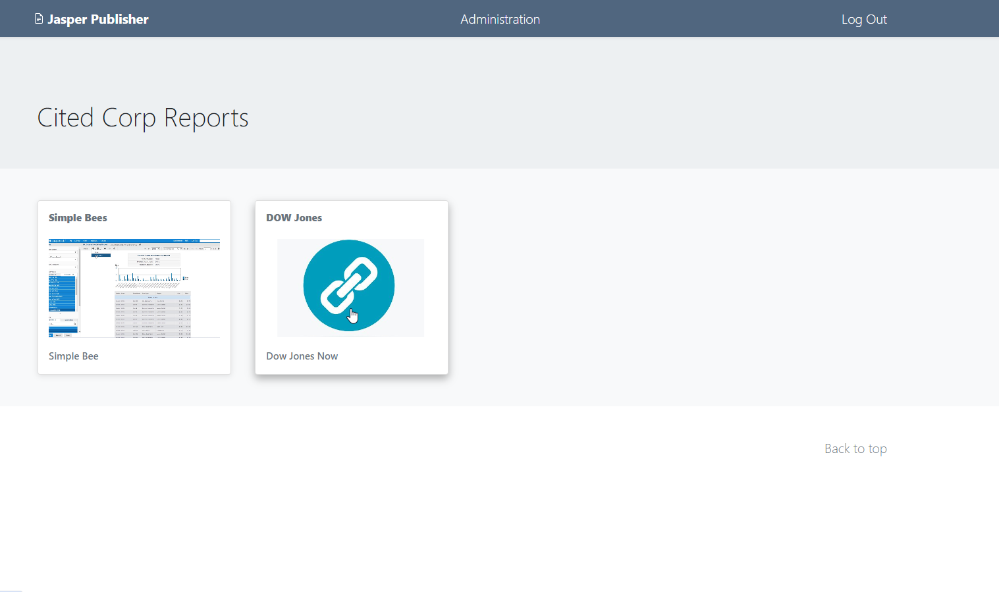

.. This is a comment. Note how any initial comments are moved by
   transforms to after the document title, subtitle, and docinfo.

.. demo.rst from: http://docutils.sourceforge.net/docs/user/rst/demo.txt

.. |EXAMPLE| image:: static/yi_jing_01_chien.jpg
   :width: 1em

**********************
Links
**********************

.. contents:: Table of Contents
Overview
==================

You can add external links to the end user dashboard.

Add Link
================

To add a new Link, click the "Add New" button at top.

Give your link a Name, Description, and URL:

The link will appear on the user dashboard as below:

.. note::
    By default, links open in a new window.

