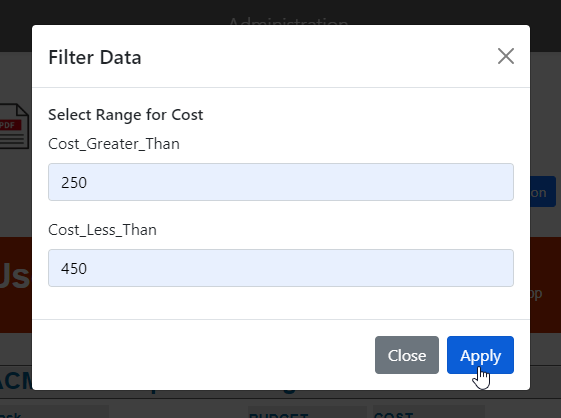

.. This is a comment. Note how any initial comments are moved by
   transforms to after the document title, subtitle, and docinfo.

.. demo.rst from: http://docutils.sourceforge.net/docs/user/rst/demo.txt

.. |EXAMPLE| image:: static/yi_jing_01_chien.jpg
   :width: 1em

**********************
Parameters
**********************
.. contents:: Table of Contents
Overview
==================

JRI Viewer supports two Parameter types.

* Dropdown/LOV - a definded List of Values
* Query - User entered parameters

Dropdown/LOV Parameter
=====================

To add an LOV parameter, click the "Add New" button at top.

.. image:: Parameter-1.png

Enter the following information:

* Paramater Type	- Enter 'dropdown'
* Paramater Name - Display name of Paramater
* Paramater Values - For LOV type, enter a comma separated list of values
* Report Name - Select the report Parameter will be applied to.

In the example below, the Values are North America, South America, and Europe.

.. image:: JRI-Viewer-Param.png

Query Parameter
=====================

To add a Query parameter, click the "Add New" button at top.

.. image:: Parameter-1.png

Enter the following information:

* Paramater Type	- Enter 'query'
* Paramater Name - Display name of Paramater
* Paramater Values - Comma separated list of Parameters to be used
* Report Name - Select the report Parameter will be applied to.

In the example below, the Values we entered are the Jasper parameters Cost_Greater_Than and Cost_Less_Than.

Edit Parameter
===================
To edit a Parameter entry, click the Edit icon

Delete Parameter
===================
To delete a Parameter entry, click the Delete icon

