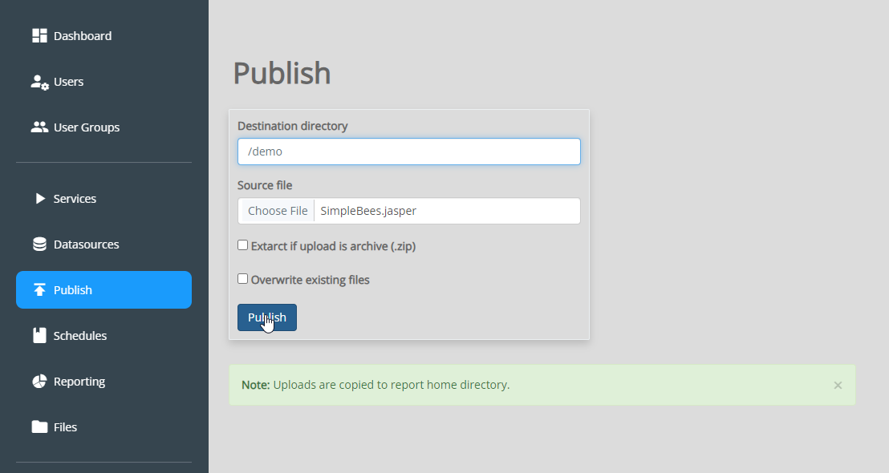

**********************
Publish
**********************

.. contents:: Table of Contents
Publishing Reports
==================

To publish a report, click Publish on the left menu:

Select the directory you wish to publish to and then select Upload to upload your .jrxml and .jasper files and any support files.

.. note::
    The file browser location is set to /home/tomcat/apache-tomcat-v/jasper_reports/reports
    
Select the directory you wish to publish to and then select Upload to upload both your .jrxml and .jasper files.

You would also include any support files, such as image files.

Creating Directories
====================

You can create directories via::

    /home/tomcat/tomcat-version/jasper-reports/reports

Options
=======

There are two options for uploading files. 

1. Upload the files individually

2. Uploaded Zipped File

Additionally, you can select "Overwrite Existing Files"

   

