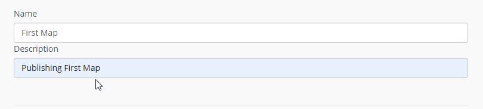
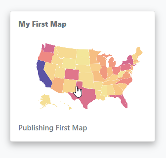
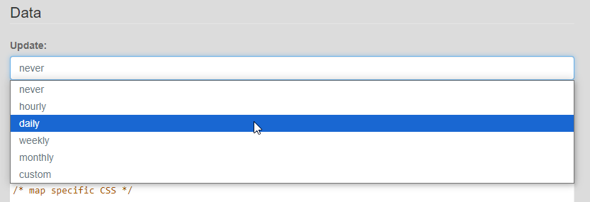
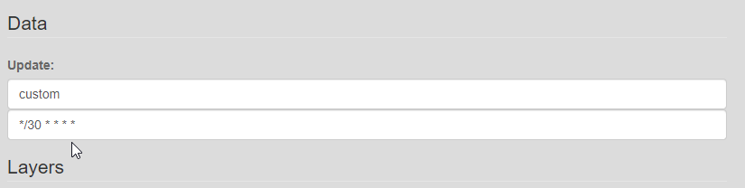
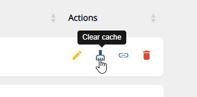
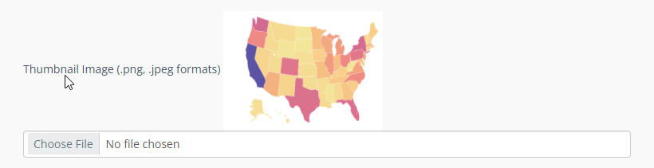
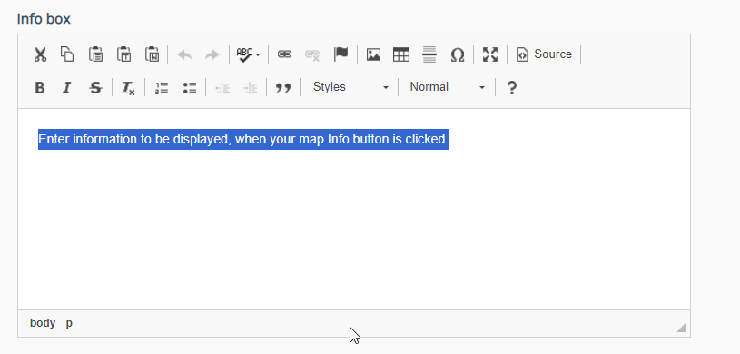
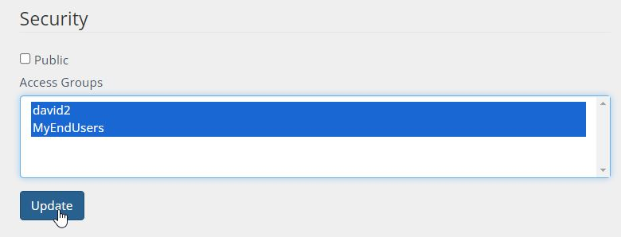
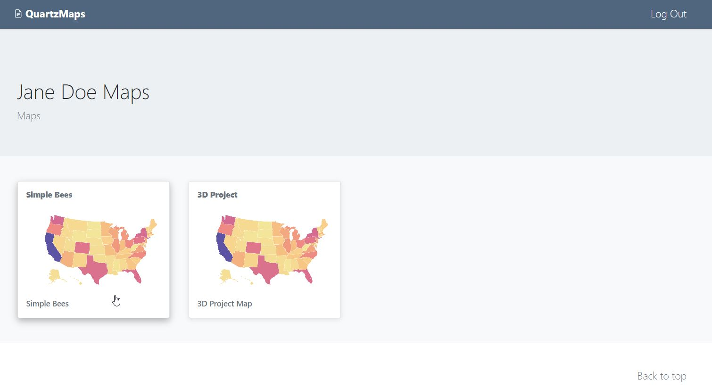
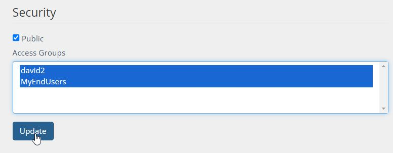

*******
R
*******

QuartzMap supports creating of a number of R HTML applications:

1. R Leaflet:  https://github.com/rstudio/leaflet/

2. Plotly:  https://plotly.com/r/

3. Standard Plots

.. contents:: Table of Contents


R Publishing
===================================

There are three options for publising your R code.

Option 1: FTP.
------------

FTP Uploads are R files you have uploaded directly via FTP.

It can also maps you uploaded via any FTP client.

   .. image:: Map-2.png


Option 2: Archive (Upload)
------------

Archive is a zipped archive file you can upload.


   .. image:: Map-3.png


Option 3: Paste
-----------------

Paste your R Leaflet code into the code box.


   .. image:: R-Paste.png


R Leaflet
===================================

To create an R Leaflet Map, click on "Add New" button.

FTP, Upload, or Paste your code.

Give your R code a Name and Description.


Example
--------------

The two main components are the libraries and saveWidget function

.. code-block:: R
   
   #libraries
   library(leaflet)
   library(leaflet.extras)
   require(sf)
   library(htmlwidgets)

   # Your R Code Here

   #saveWidget
   saveWidget(m, file = "index.html") 

An example Choropleth map is included in the installation.


.. code-block:: R

   library(leaflet)
   library(leaflet.extras)
   require(sf)
   library(htmlwidgets)


   # From https://leafletjs.com/examples/choropleth/us-states.js
	states <- sf::read_sf("https://rstudio.github.io/leaflet/json/us-states.geojson")

	bins <- c(0, 10, 20, 50, 100, 200, 500, 1000, Inf)
	pal <- colorBin("YlOrRd", domain = states$density, bins = bins)

	labels <- sprintf(
	  "<strong>%s</strong><br/>%g people / mi<sup>2</sup>",
	  states$name, states$density
	) %>% lapply(htmltools::HTML)

   m <- leaflet(states) %>%
  	setView(-96, 37.8, 4) %>%
  	addPolygons(
	fillColor = ~pal(density),
    	weight = 2,
    	opacity = 1,
    	color = "white",
    	dashArray = "3",
    	fillOpacity = 0.7,
    	highlightOptions = highlightOptions(
      	weight = 5,
      	color = "#666",
      	dashArray = "",
      	fillOpacity = 0.7,
      	bringToFront = TRUE),
    	label = labels,
    	labelOptions = labelOptions(
      	style = list("font-weight" = "normal", padding = "3px 8px"),
      	textsize = "15px",
      	direction = "auto")) %>%
   addLegend(pal = pal, values = ~density, opacity = 0.7, title = NULL,
    	position = "bottomright") %>%
   addTiles(group="OpenStreetMap") %>%
   addProviderTiles(providers$Esri.WorldImagery, group = "Esri World Imagery") %>%
   addLayersControl(baseGroups=c("OpenStreetMap", "Esri World Imagery"), options=layersControlOptions(collapsed=FALSE)) %>%
   addMeasurePathToolbar(options = measurePathOptions(imperial = FALSE, showDistances = TRUE)) %>% 
   addDrawToolbar(
  	targetGroup = "draws",
	editOptions = editToolbarOptions(
        selectedPathOptions = selectedPathOptions()))

   saveWidget(m, file = "index.html") 


The output should look as below:

   .. image:: R-Choropleth.png


R Plotly
===================================

To create an R Plotly  Animated App, click on "Add New" button.

FTP, Upload, or Paste your code.

Give your R code a Name and Description.


Example
--------------

The example is animated Plotyl map with Play button.

The three main components in this example are the plotly, dplyr, and htmlwidgets function.


.. code-block:: R
   
   # Main libraries for Plotly
     library(dplyr)
     library(plotly)
     library(htmlwidgets)

   # Your R Code Here

   #saveWidget
   htmlwidgets::saveWidget(as_widget(p), file="index.html")


An example of a Plotly app is included in the installation.  Here, we add the RPostgreSQL library to connect to PostgreSQL.


.. code-block:: R

      #load library
      library(dplyr)
      library(plotly)
      library(htmlwidgets)

      #load data
      df <- read.csv("graph.csv")

      #create map
      p <- plot_geo(df, locationmode = 'world') %>%
	      add_trace( z = ~df$new_cases_per_million, locations = df$code, frame=~df$start_of_week, color = ~df$new_cases_per_million)

      #export as html file
      htmlwidgets::saveWidget(p, file = "index.html")


The output should look at below:


   .. image:: R-Animated.png


R Plotly Dynamic Data (PostgreSQL)
===================================

To create an R Plotyl App with Dynamic Data, click on "Add New" button.

FTP, Upload, or Paste your code.

Give your R code a Name and Description.


Example
--------------

The main components in this example are the plotly, ggplot2, RPostgreSQL, and htmlwidgets function.


.. code-block:: R
   
   # Main libraries for Plotly
      library(plotly)
      library(ggplot2)
      library(RPostgreSQL)
      library(htmlwidgets)

   # Your R Code Here

   #saveWidget
   htmlwidgets::saveWidget(as_widget(p), file="index.html")

The example is chart with dynamic PostgreSQL connection is contained in the Sample Apps (Simple Bee Harvest)

Here, we add the RPostgreSQL library to connect to PostgreSQL.


.. code-block:: R

      library(plotly)
      library(ggplot2)
      library(RPostgreSQL)
      library(htmlwidgets)

      conn <- RPostgreSQL::dbConnect("PostgreSQL", host = "localhost", dbname = "beedatabase", user = "admin1", password = "ORUVDrYBCQ")

      query_res <- dbGetQuery(conn, 'select area_id,bee_species,sum(average_harvest) from public.apiary GROUP BY (area_id,bee_species) ORDER BY(area_id)');
      area_harvest <- as.data.frame(query_res);

      p <- plot_ly(area_harvest, x=~area_id, y=~sum, type="bar",
 		text = ~bee_species, textposition = 'auto') %>%
	   layout(title = "Accumulated Average Harvest per Area for Apis Mellifera Carnica",
         xaxis = list(title = "Area ID"), yaxis = list(title = "Average Harvest"))

	
      htmlwidgets::saveWidget(as_widget(p), file="index.html")


The output should look at below:


   .. image:: rplotly-postgresql.png


R Standard Plot (PNG)
===================================

To create an R Standard Plot (PNG) Map, click on "Add New" button.

FTP, Upload, or Paste your code.

Give your R code a Name and Description.


Example
--------------

The three main components are the R3port and  html_plot function.

.. code-block:: R
   
   # Main libraries for Plotly
   library(R3port)

   # Your R Code Here

   #output
   html_plot(pl(),	out="index.html")


An example of a Standard Plot (PNG) is included in the installation.

.. code-block:: R

   library(R3port)

   set.seed(1919)                                 # Create example data
   x1 <- rnorm(1000)
   y1 <- x1 + rnorm(1000)

   group <- rbinom(1000, 1, 0.3) + 1              # Create group variable

   pl <- function() {
	   plot(x1, y1,                                   # Create plot with groups
         main = "This is my Plot",
         xlab = "X-Values",
         ylab = "Y-Values",
         col = group,
         pch = group)
		 
      legend("topleft",                              # Add legend to plot
         legend = c("Group 1", "Group 2"),
         col = 1:2,
         pch = 1:2)
      }

   html_plot(pl(),	out="index.html")


R Report (RMD)
===================================

To create an R Report App, click on "Add New" button.

FTP, Upload, or Paste your code.

Give your R code a Name and Description.


Example
--------------

The Demo Data contains a full R Report.

It is the "My Super Fancy Report" created by David Keyes

https://rfortherestofus.github.io/fundamentals/sample-report.html

.. code-block:: R

         ---
         title: "My Super Fancy Report"
         author: "David Keyes"
         output: html_document
         ---

         ```{r setup, include=FALSE}
         knitr::opts_chunk$set(echo = FALSE)
         ```


         # Introduction

         This report is the best report ever. Pretty much the **bees' knees**. Can't say that I've *ever* seen a better report.

         ## Reasons Why This Report is the Best

         - It's amazing
         - It's quite amazing
         - It's seriously amazing

         ## R Markdown

         This is an R Markdown document. Markdown is a simple formatting syntax for authoring HTML, PDF, and MS Word documents. For more details on using R Markdown see <http://rmarkdown.rstudio.com>.

         When you click the **Knit** button a document will be generated that includes both content as well as the output of any embedded R code chunks within the document. You can embed an R code chunk like this:

         ```{r cars, include = FALSE}
         summary(cars)
         ```

         ## Including Plots

         You can also embed plots, for example:

         ```{r pressure, echo=FALSE}
         plot(pressure)
         ```


         Note that the `echo = FALSE` parameter was added to the code chunk to prevent printing of the R code that generated the plot.


         ```{r warning = FALSE, message = FALSE}
         library(skimr)

         skim(cars)
         ```

The output should look at below:


   .. image:: r-report.png

 


R App Options
===================================

Name
--------------

Give your R app a name.  The name will appear as the map title on the dashboard.




Description
--------------

The Description is the text that will appear at the bottom of the map link




Data Update (Cache)
--------------

For dynamic R apps that connect to a databases, you can set the update frequency




If you wish to set a custom interval, select custom:




When Updates are selected, this is the interval at which your app will be recompiled against the database.

If you have enabled Updates, but wish to Update immediately, you can do so by clicking the Clear Cache icon on the Map page:




Thumbnail Image:
--------------

Upload a thumbnail image for your map to be displayed on the home page.




Info Box.
--------------

The InfoBox is a modal information box you can display to map users.




Security
--------------

Maps can be Private or Public.

The Security section is where you assign permissions to your map.

Security is Group based, so any users belonging to the Group will be able to view the map.



1. Private

Private apps can be viewed by the user logging into your map portal or via Secure Share link (for temporary access)

For example, since we gave access to the Group containing user Jane Doe, when she logs in she will see only the two maps she has permissions to



2. Public

You can also tick the “Public” box to make your app public.



If your map is “Public”, you can use the map url to display the map.

By default, the app is full screen. You can also use an iframe.
