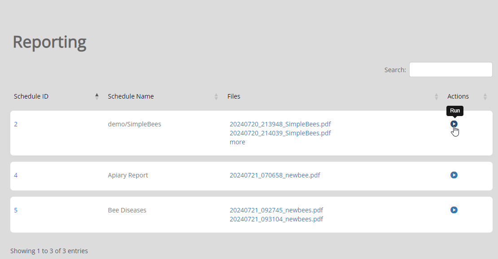
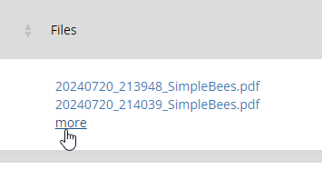
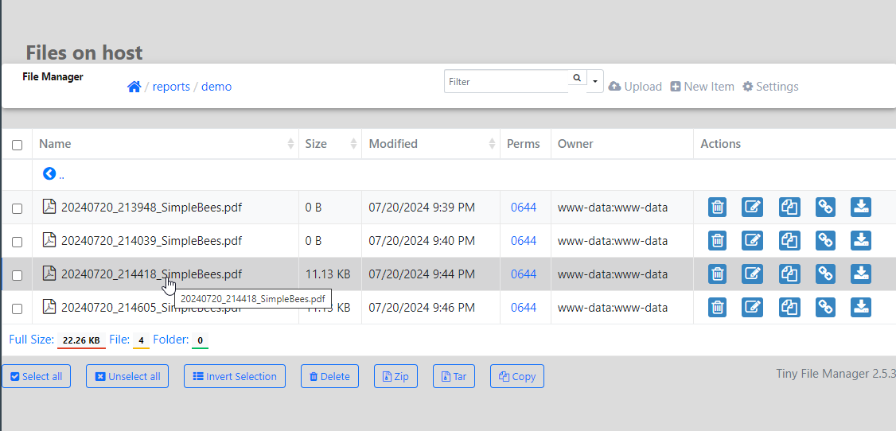

**********************
Manual Run
**********************

.. contents:: Table of Contents
Overview
==================

Admins can run Scheduled Reports manually at any time via the Reporting menu.

This menu also links to Scheduled Report outputs.

To run a Scheduled Report manually, click Reporting on the left menu

Click the Run icon to the right of the report.

.. note::
    Running a Scheduled Report that is emailed with result in the email being as well.

View Output
================

To view the output, click on the Files column.

If more than 3 reports are present, a "More" option will appear.

Clicking the "More" option will take you to the file output location to access all reports

