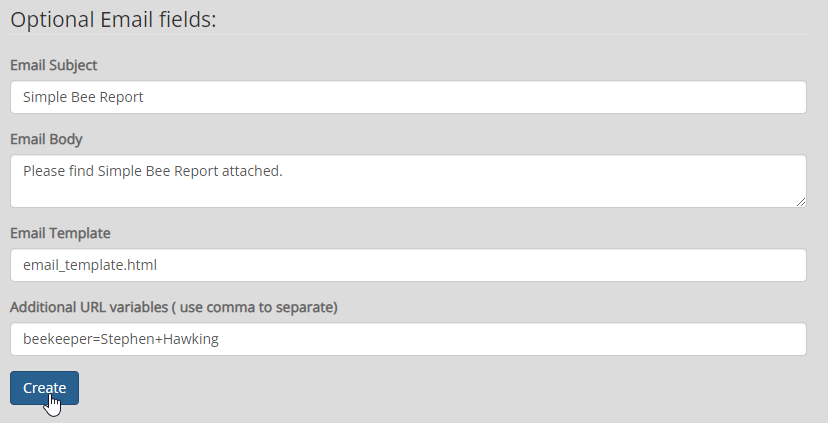
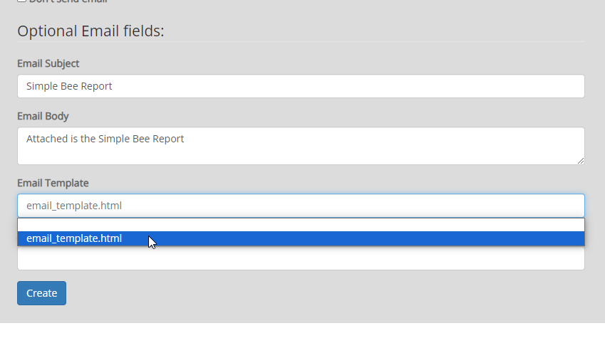
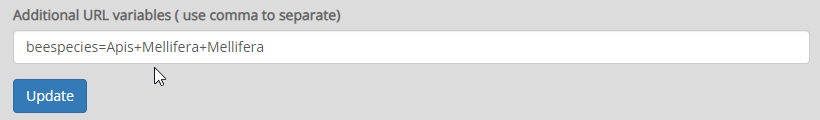

**********************
Schedule
**********************

.. contents:: Table of Contents
Scheduling Reports
==================

Click on Schedule on the left menu.

Click the Add Schedule button

.. image:: ../../_static/schedule-1.png

The top section includes required fields:

.. image:: ../../_static/schedule-options-0.png   

The bottom section includes optional fields for email reports

Scheduling Options
==================

The Schedule module offers the following options.

**Execute**::

   Options:
      now
      custom
      hourly
      weekly
      monthly
      
now:  This will run the report immediately, with no subsequent runs.

custom: This option allows you to enter a custom cron for running the report
 
hourly, weekly, and monthly are as stated.
 
**Name**::

   Options:
      Drop-down list of all available reports

The Name field will display a list of all available reports.  Above, we have select the NewReports/ClassReports we created earlier.

**Format**::

   Options:
      csv
      docx
      html
      html2
      jxl
      pdf
      pptx
      rtf
      xls
      xlsx

Select the desired output format for the report.

**Data Source**::

   Options:
      Displays a drop-down list of Data Sources you have created.

Select the desired Data Source for the report.

**File Name**::

   Options:
      Enter the desired file name WITH Extension.
      Example: ClassReports.pdf

Enter the desired Data Source for the report.

**Email**::

   Options:
      Enter email address or comma separated list of addresses for delivery.

Enter the desired Data Source for the report.

.. note::
    If you do not wish to email the report, tick the "Don't send email" box.  
    This will run the report and save it to disk on the server.
    The report can be retrived via disk or downloaded via Reports tab.

Optional Params
===============

The Optional Params tab allows you to:

1. Set email subject
2. Set email message
3. Add report parameters
4. Use HTML Templates for email

Email HTML Templates
=====================

The directory for storing HTML templates for email is::

     /home/tomcat/apache-tomcat-version/jasper_reports/email_tmpl 

This directory contains a started template you can customize (email_template.html).

You can also add your own templates to this directory as well.

Any templates in this directory will appear in the dropdown box on the Report Schedule page;

Using the included email_template.html, the Report email will look like below:

.. image:: ../../_static/email-templates.png

URL Parameters
===============

To add Report Parameters to the report URL, enter the parameter(s) as shown below:

You can add as many parameters as you wish to.

   

