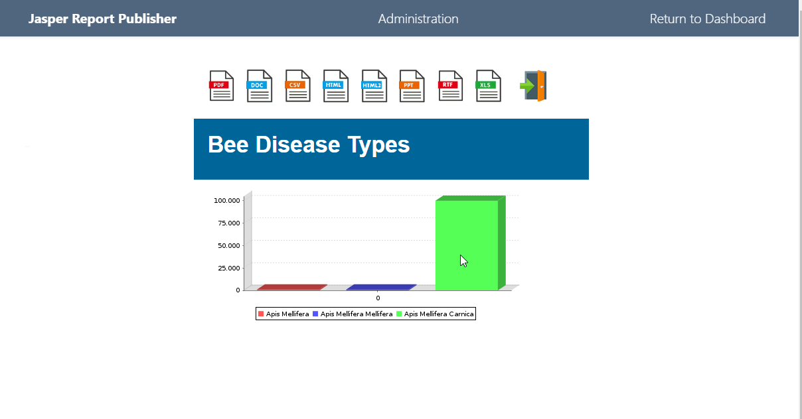
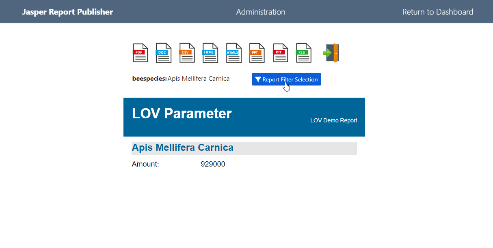
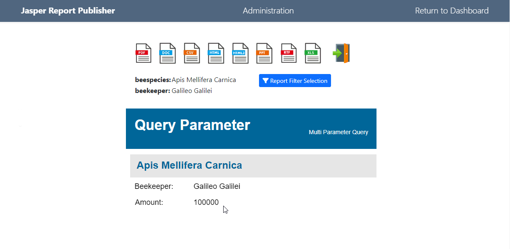
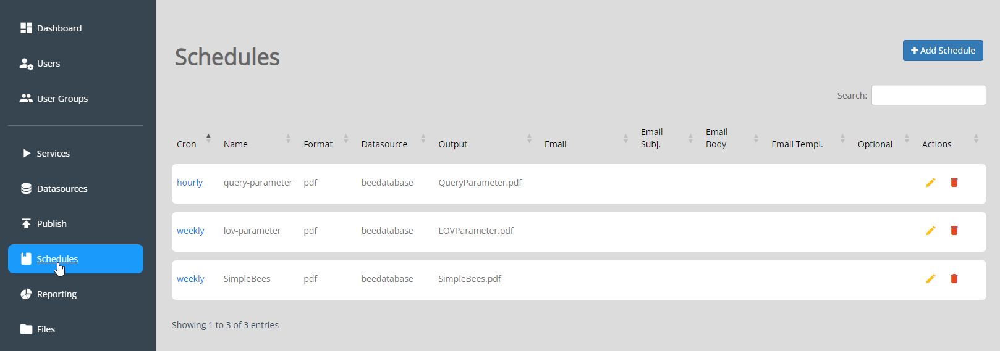
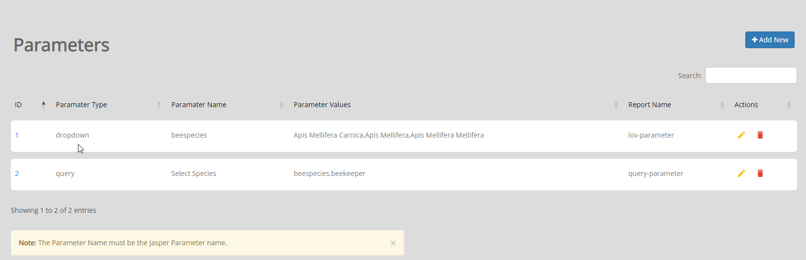

.. This is a comment. Note how any initial comments are moved by
   transforms to after the document title, subtitle, and docinfo.

.. demo.rst from: http://docutils.sourceforge.net/docs/user/rst/demo.txt

.. |EXAMPLE| image:: static/yi_jing_01_chien.jpg
   :width: 1em

**********************
Structure
**********************

.. contents:: Table of Contents
Overview
==================

The primary directory for Jasper Report Publisher is located at:

/home/tomcat/tomcat-VERIONS/jasper_reports and looks as below (this includes Demo Data)::

   ├── conf
   │   ├── application.properties
   │   ├── application.properties.save
   │   └── log4j2.xml
   ├── email_tmpl
   │   └── email_template.html
   ├── jri_schedule.crontab
   ├── logs
   │   └── JasperReportsIntegration.log
   ├── reports
   │   ├── Cherry.jrxml
   │   ├── SimpleBees.jasper
   │   ├── SimpleBees.jrxml
   │   ├── cherry.jpg
   │   ├── demo
   │   │   ├── charts.jrxml
   │   │   ├── encrypt-pdf.jrxml
   │   │   ├── flower1.png
   │   │   ├── issue-with-query.jrxml
   │   │   ├── leaf_banner_red.png
   │   │   ├── long-running-report.jrxml
   │   │   ├── master_detail.jrxml
   │   │   ├── master_detail_subreport1.jrxml
   │   │   ├── opal_logo_50px_hoch.jpg
   │   │   ├── opal_logo_50px_hoch_2.jpg
   │   │   ├── order.jrxml
   │   │   ├── orders-test.jrxml
   │   │   ├── orders.jrxml
   │   │   ├── qr.jrxml
   │   │   ├── test_images.jrxml
   │   │   └── top_orders.jrxml
   │   ├── lov-parameter.jasper
   │   ├── lov-parameter.jrxml
   │   ├── query-parameter.jasper
   │   ├── query-parameter.jrxml
   │   └── test.jrxml
   └── schedules
    ├── 1_env.sh
    ├── 2_env.sh
    └── 3_env.sh

conf
================

The conf file is used directly from JasperReportsIntegration.

This stores general configuration information as well as Data Source information.

The file can be edited manually, but a backup should be taken prior to doing so.

Sample Reports
================

Three Sample Reports are created

* Simple Bee Report	- this is a basic chart report

* LOV Parameter - This is a basic report using a single LOV (List of Values) Parameter

* Query Parameter - This is a basic report using two Query Parameters

Sample Schedules
================

A sample Schedule is created for each report.

Note: These Schedules, do not have email activated.  You can edit them to include email delivery to test email functionality.

Sample Parameters
=====================

Sample Parameters are include for the LOV Parameter and Query Parameter reports

Delete Sample Data
===================

To delete the sample data:

1. Delete Sample Schedules
2. Delete Sample Reports
3. Delete Sample Data Sources
4. Drop beedatabase

