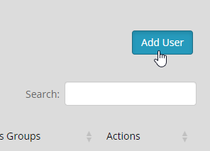
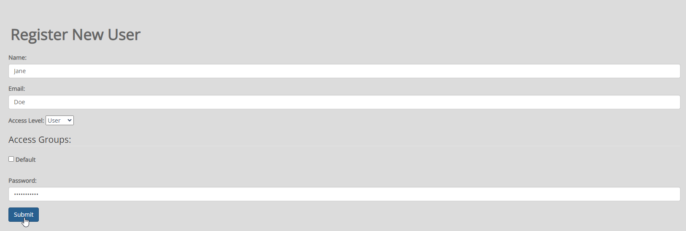
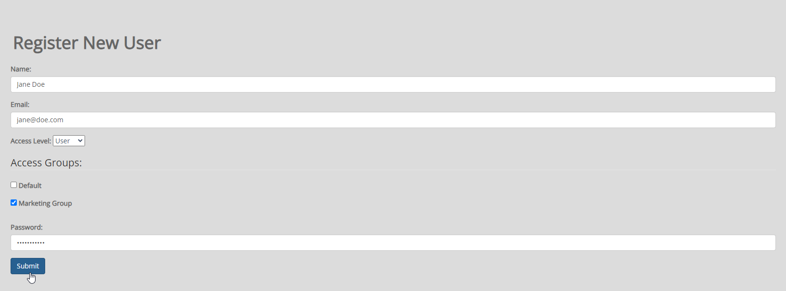
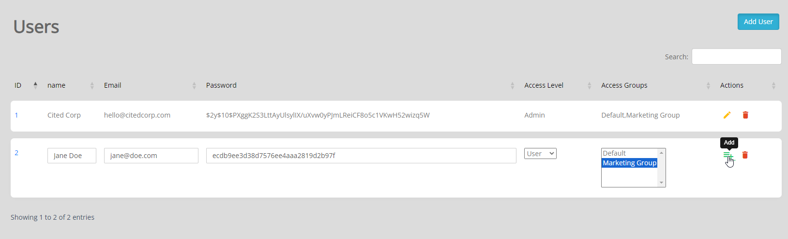

.. This is a comment. Note how any initial comments are moved by
   transforms to after the document title, subtitle, and docinfo.

.. demo.rst from: http://docutils.sourceforge.net/docs/user/rst/demo.txt

.. |EXAMPLE| image:: static/yi_jing_01_chien.jpg
   :width: 1em

**********************
Users
**********************
.. contents:: Table of Contents
Overview
==================

Jasper Report Publisher grants permissions on Reports to User Groups.

You can begin by creatting Users and then Groups, or vice versa.

User Types
==================

Jasper Report Publisher supports the following User types:

1. Admins.  Can create Data Sources, Publish Reports, and create Schedules.
2. Users.   Can consume reports via Dashboard

Add New User
================

To create a new user, click on Users on the left menu.

Click the Add User button

Enter the required information and be sure to set the Access Level (Admin or User)

If the Group(s) you wish to add To add the user to are already created, you can add them as below:

Edit Group Membership
===================

You can always edit Group Membership later as well via both Users and User Groups menu.

Delete User
===================
To delete a user, click the Delete icon to the right of the Users name.

