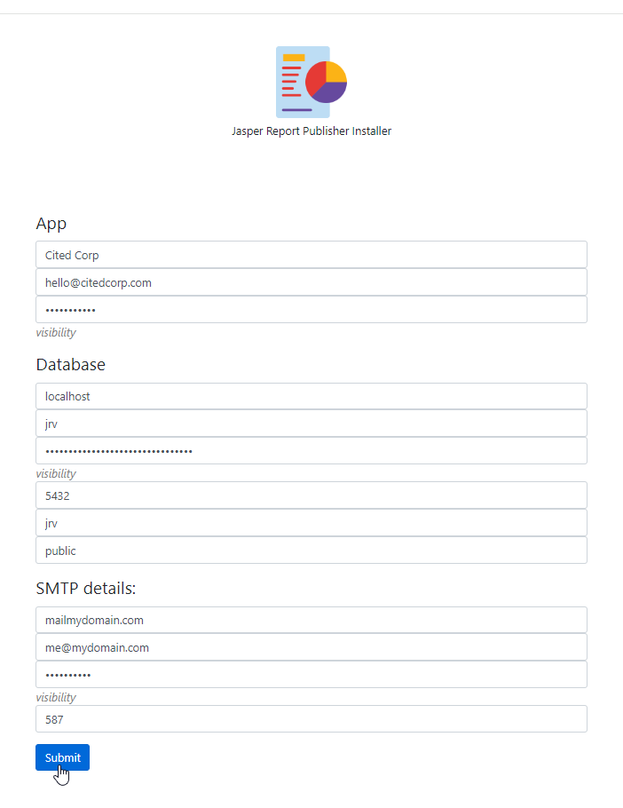

************
Installation
************

Installation is done via setup.php located in the /admin directory

PHP and PostgreSQL are required.

Create a PostgreSQL database and run the installer.

Running the Installer
=======================

Clone or download the repoistory

.. code-block:: console
   :linenos:

    git clone https://github.com/AcuGIS/Jasper-Publisher
    mv Jasper-Publisher-master Jasper-Publisher

Navigate to /JasperPublisher and run the installers:

.. code-block:: console
   :linenos:

   ./installer/postgres.sh
   ./installer/app-install.sh
   ./installer/jri-install.sh

Optionally, run below to provision SSL using letsencrypt:

.. code-block:: console
   :linenos:

   apt-get -y install python3-certbot-apache

   certbot --apache --agree-tos --email hostmaster@yourdomain.com --no-eff-email -d yourdomain.com

Navigate to https://yourdomain.com/admin/setup.php:

.. image:: _static/install-1.png

Enter the information for the PostgreSQL database you created:

The installer will create the required objects in PostgreSQL

When the installer completes, you can log in using the default admin@admin.com/1234

.. image:: _static/install-3.png

PhantomJS
===================

Printing of GroupedReports requires phantomjs to be installed on your server.

