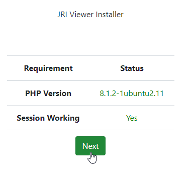
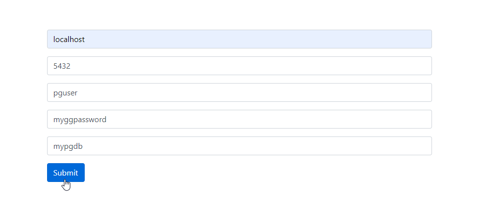
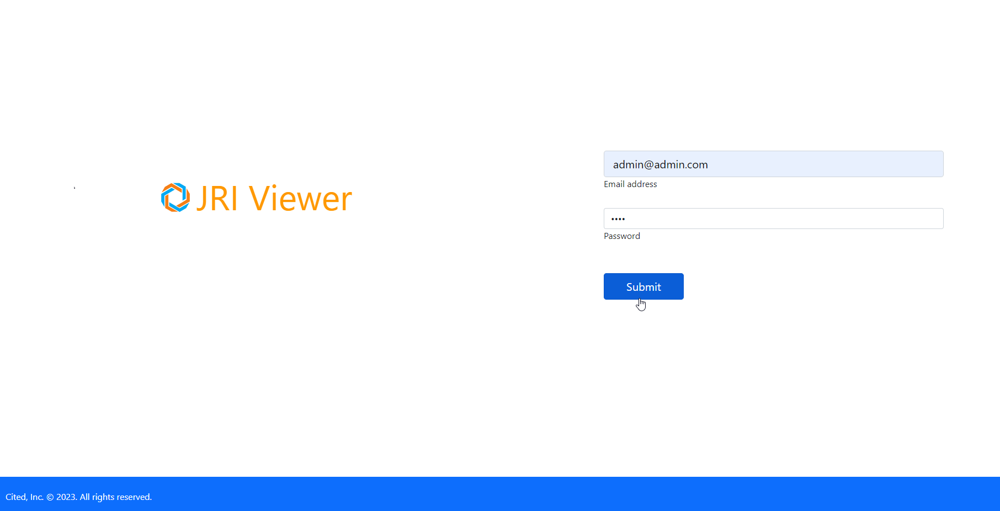

************
Installation
************

Installation is done via setup.php located in the /admin directory

PHP and PostgreSQL are required.

Create a PostgreSQL database and run the installer.

Running the Installer
=======================

Clone or download the repoistory

.. code-block:: console
   :linenos:

    git clone https://github.com/cited/jri-viewer
    mv jri-publisher-master jri_viewer

Navigate to /admin/setup.php

Enter the information for the PostgreSQL database you created:

The installer will create the required objects in PostgreSQL

When the installer completes, you can log in using the default admin@admin.com/1234

PhantomJS
===================

Printing of GroupedReports requires phantomjs to be installed on your server.

