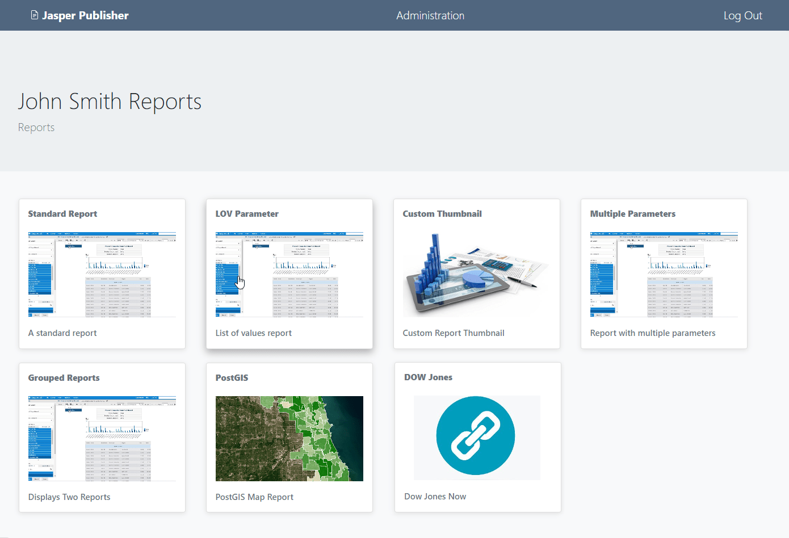

Intro
===========================

Overview
------------

Jasper Publisher publishes, schedules, emails, and runs Jasper Reports on demand.

It supports PotgreSQL, Oracle, MySQL, and MSSQL and you can add additional data sources.

Jasper Report Publisher is free, Open Source software that uses `JasperReportsIntegration`_ as the engine for processing reports.

.. _`JasperReportsIntegration`: https://github.com/daust/JasperReportsIntegration 

Authors
-------
* `David Ghedini`_
* `Kaloyan Petrov`_
* `AcuGIS`_

.. _`David Ghedini`: https://github.com/DavidGhedini
.. _`Kaloyan Petrov`: https://github.com/kaloyan13
.. _`AcuGIS`: https://www.acugis.com

Components
-------------

* `JasperReportsIntegration`_
.. _`JasperReportsIntegration`: https://github.com/daust/JasperReportsIntegration 
* Apache Tomcat
* PostgreSQL
* PHP
* Postfix
* MUTT

Open Source
-----------

Jasper Publisher is Free, Open Source Software.

GNU GENERAL PUBLIC LICENSE v3

    

