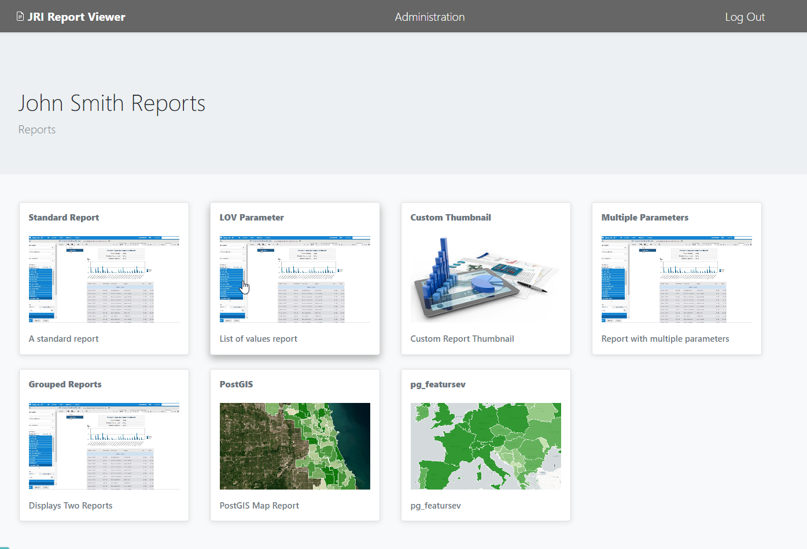

Intro
===========================

Overview
------------

JRI Viewer is a stand-alone PG-PHP application for viewing and exporting Jasper Reports on demand.

It does not require JRI Publisher and can be used with any (and multiple) instances of `JasperReportsIntegration`_

.. _`JasperReportsIntegration`: https://github.com/daust/JasperReportsIntegration 

It supports Users, Groups, and report-level permissions.

System Requirements
-------------------
* PostgreSQL
* PHP >= 8.0

Authors
-------
* `David Ghedini`_
* `Kaloyan Petrov`_

.. _`David Ghedini`: https://github.com/DavidGhedini
.. _`Kaloyan Petrov`: https://github.com/kaloyan13

Open Source
-----------

JRI Publisher is Free, Open Source Software.

GNU GENERAL PUBLIC LICENSE v3

    

