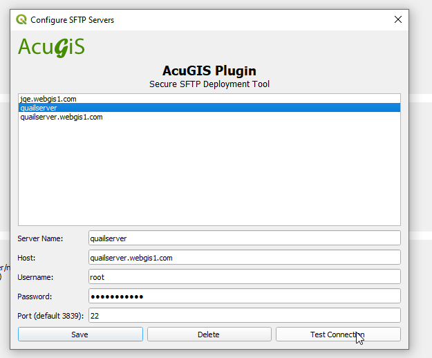

**********************
SFTP Plugin
**********************

.. contents:: Table of Contents
Installation
==================

Download acugis_sftp_tool.zip to your desktop

In QGIS, go to Plugins > Manage and Install Plugins and click on "Install from Zip" in left menu.

.. image:: install.png

Once installed, you should see the Plugins menu.
  
Begin by selecting 

  

.. image:: plugin-1.png

.. image:: Upload.png

.. note::
    The file browser location is set to /home/tomcat/apache-tomcat-v/jasper_reports/reports
    
Select the directory you wish to publish to and then select Upload to upload both your .jrxml and .jasper files.

You would also include any support files, such as image files.

Creating Directories
====================

You can create directories via::

    /home/tomcat/tomcat-version/jasper-reports/reports

Options
=======

There are two options for uploading files. 

1. Upload the files individually

2. Uploaded Zipped File

Additionally, you can select "Overwrite Existing Files"
