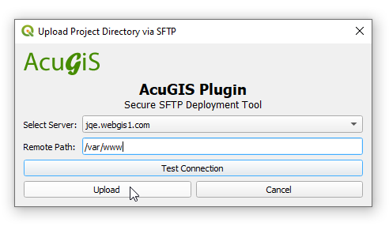

**********************
SFTP Plugin
**********************

.. contents:: Table of Contents
Installation
==================

Download acugis_sftp_tool.zip to your desktop

In QGIS, go to Plugins > Manage and Install Plugins and click on "Install from Zip" in left menu.

Browse to location where you saved acugis_sftp_tool.zip and then click "Install Plugin"

.. image:: install-1.png

Once installed, you should see the Plugins menu.

Usage
==================
  
Begin by selecting Configure SFTP servers:  

.. image:: plugin-1.png

Click Add to add server(s).

Click Save.

Go to Upload Project Directory via SFTP

Select the Server you wish to upload to.  Also select the Remote Location (file path) to upload to (e.g. /var/www/html)

If your owner is a user:group other than wwww-data, change it in the Owbership field.

.. warning::
    The entire QGIS Project directory will be uploaded.

Click Upload

.. note::
    If files exist, you will prompted if you wish to overwrite files.
    
A success message will be displayed up completion.

